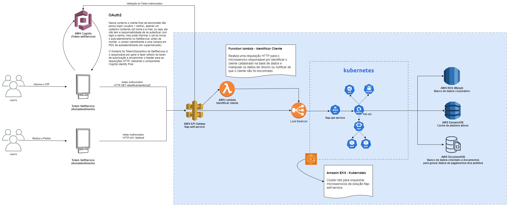
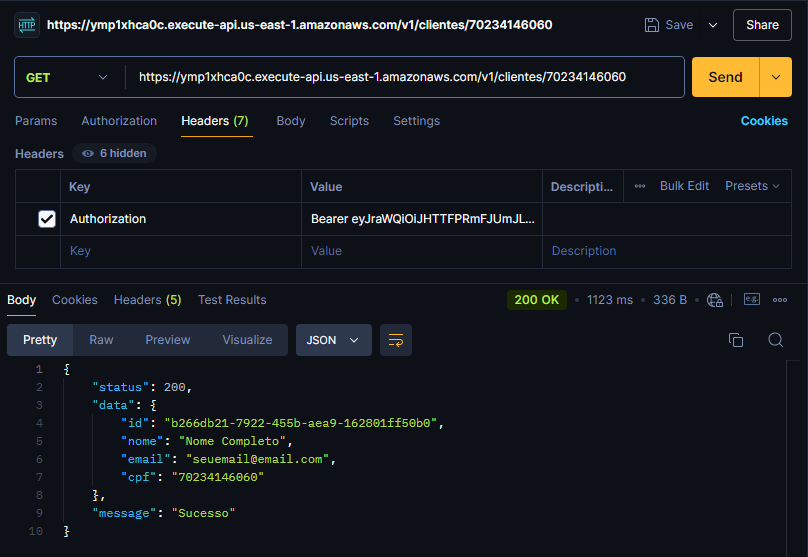

# AWS EKS - Infra Kubernates com terraform.

### Requisito 2.b - Tech Challenge - Fase 3

* 1 repositório para sua infra Kubernetes com Terraform.

### Solução da Arquitetura



Conforme proposto no diagrama de integração, utilizamos uma API Gateway integrada ao sistema de autenticação Cognito da AWS para segurança dos endpoints da aplicação.
A API Gateway, aciona o load balancer do EKS responsável por acionar os endpoints da aplicação [fiap-self-service](https://github.com/Fiap-Self-Service/fiap-self-service).

Exemplo CURL para requisição: 
```
curl --location 'https://ymp1xhca0c.execute-api.us-east-1.amazonaws.com/v1/clientes/{cpf}' \
--header 'Authorization: Bearer {token}'
```

Exemplo de Response:



Este repositório utiliza Github Actions para automatizar o deploy das configurações terraform.

**Para ativar e desativar o cluster k8s e todos os recursos provisionados por este repositório, basta alterar o arquivo config.json e abrir pull request para a alteração na branch main.**

### Executar Local
Lembre-se de configurar ./aws/credentials e configurar variaveis de ambiente:

```
export AWS_ACCESS_KEY_ID=....
export AWS_SECRET_ACCESS_KEY=....
```

### Comandos úteis
```
terraform init
terraform fmt
terraform validate

# Aplicar configurações
terraform apply

# Destruir configurações
terraform destroy
```
### Conectar kubectl ao cluster
`aws eks update-kubeconfig --region us-east-1 --name fiap-self-service-k8s`

`kubectl get svc` 

